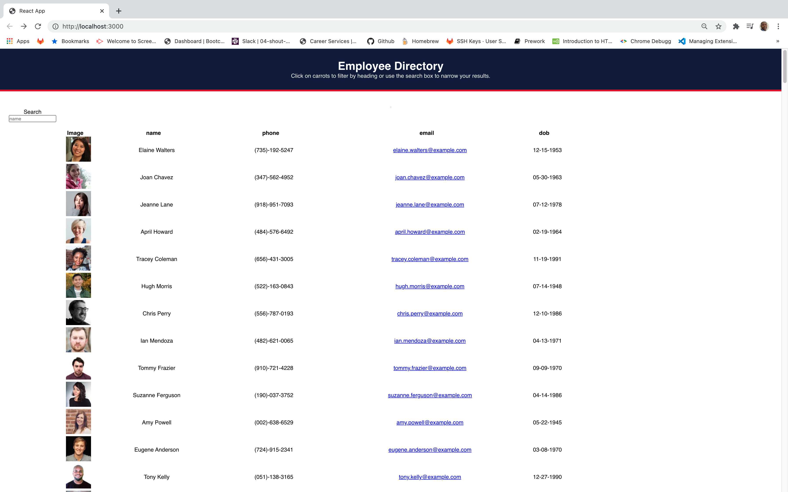

# employee-directoryHW

## Description
This application is a table of random user generated employee data that renders a webpage.
When the webpage is rendered the use should be able to seach, filter, and/or sort by image, name,
phone number, email, or date-of-birth.

## User Story
As a user, I want to be able to veiw my entire employee direecta at once so that I have
quick access to their information.
## Technologies Uses

REACT

## Github Deployment Link

https://byrdfabian.github.io/employee-directoryHW/

### To Run this Application

* Clone reposititory to your local machine
* Open it in your editor
* Open new terminal from inside the root directory
* Type npm start and hit enter

## Screenshot of Application

